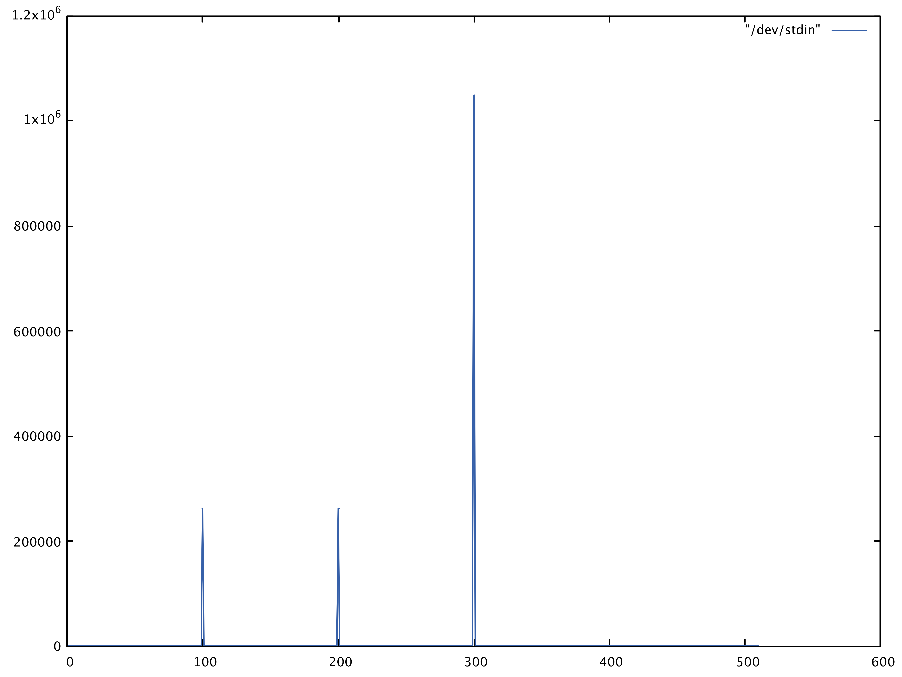

## Discrete Fourier Transform (DFT) 

The [Discrete Fourier Transform (DFT)](dft.c) is a fundamental tool in many Digital Signal Processing (DSP) application and often finds very fitting applications in embedded systems. Mathematically, the DFT can be represented using the following equation [1]:


Its primary function consists in converting a finite series of equally spaced samples in the time domain into a same-length, equally-spaced series of samples in the frequency domain. It can also be interpreted as:

 * A complete description of the Discrete-Time Fourier transform (DTFT) of an N-periodic sequence, which comprises only discrete frequency components.
 * A series of uniformly spaced samples of the continuous DTFT of a finite length sequence. (Sampling the DTFT)
 * The cross correlation of the input sequence and complex sinusoid at frequency k/N.
 * The discrete analog of the formula for the coefficients of a Fourier series

## Application in embedded systems

While very concise, the strict mathematical equation of the DFT is hard to directly translate into an efficient embedded implementation due to the existance of floating point multpilication and complex sin() and cos() operations.

The [code](dft.c) provided will explore the potential improvement that can be obtained by pre-computing some of the most resource-intensive operations, using the following methods:

1. **Basic**: naive implementation of the mathematical equation for DFT, using the sin() and cos() function provided in the `<math.h>` header of the C standard library (implementation specific)

2. **Optimized**: a more concise version of the basic implementation, where some of the multiplications are pre-computed at each step. This version of the DFT does not require significantly more memory allocation, but lowers the number of operations required.

3. **Lookup**: a DFT implementation [2] where all the multiplicative coefficients are pre-computed and stored in memory. This method provides the significant adavntage of not using sin() and cos(), but has a space complexity of O(N), where N is the number of samples in the input.

All of the above implementations, however, have a time complexity of O(N^2), since they are based on a basic implementation of the DFT algorithm. The only way to improve the time complexity is switching to a more efficient algortihmic implementation (FFT).

## Visualization

The driver code provides a dummy imput sampled at 1 kHz, where 3 main frequencies have been added with different amplitudes at 100, 200 and 300 Hz.



The output of the DFT power spectrum was then printed to `stdout` and plotted using a the unix utility GNUplot, clearly showing the three main frequency componts as expect 


## Timing
The following is the output of the driver program run with different number of elements in the input array for the DFT, specifically [64, 256, 1024, 4096]. Each timing result is the average of 100 calls to the sorting function, starting from a random array. 

```
./dft 64
[DFT LOOKUP: 0.07 ms, N = 64]
[DFT OPTIMIZED: 0.30 ms, N = 64]
[DFT BASIC: 0.40 ms, N = 64]
./dft 256
[DFT LOOKUP: 0.88 ms, N = 256]
[DFT OPTIMIZED: 3.34 ms, N = 256]
[DFT BASIC: 6.32 ms, N = 256]
./dft 1024
[DFT LOOKUP: 16.65 ms, N = 1024]
[DFT OPTIMIZED: 60.21 ms, N = 1024]
[DFT BASIC: 92.69 ms, N = 1024]
./dft 4096
[DFT LOOKUP: 210.90 ms, N = 4096]
[DFT OPTIMIZED: 849.56 ms, N = 4096]
[DFT BASIC: 1486.64 ms, N = 4096]

```

## Conclusions

As it is possible to note, the improvements in terms of performances only follow a linear trend, while the time complexity increase of the DFT itself is quadratic. 

However, it is clear that if stringent time costraints are a priority, it is worth considering the lookup implementation for a significant performance increase. 

## References :

1. [Discrete Fourier Transform, Wikipedia](https://en.wikipedia.org/wiki/Discrete_Fourier_transform)
2. [Ted Burke, Simple DFT in C](https://batchloaf.wordpress.com/2013/12/07/simple-dft-in-c/)
