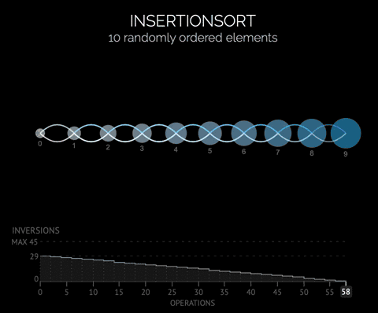
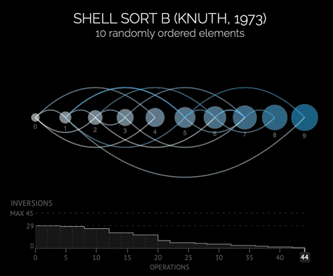
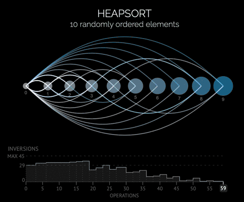

## Sorting 

[Sorting](embedded_heapsort.c) is a key component of many embedded applications, and is one of the fundamental aspects of programming. 

Embedded systems, however, present some specific challenges and constraints that limit the use of traditional recursive sorting (e.g. quicksort). Specifically code size and memory usage are high priority in these kind of applications.

To be effective for an embedded implementation, and especially for real time applications, any software based sorting algorithm needs to adhere to the following best practices [1]:

1. It must sort in place.
2. The algorithm must not be implemented using recursion.
3. Its best, average and worst case running times should be of similar magnitude.
4. Its code size should be commensurate with the problem.
5. Its running time should increase linearly or logarithmically with the number of elements to be sorted.
6. Its implementation should be free of breaks and returns in the middle of a loop.

The [code](embedded_sorting.c) provided in this section will explore three main algorithms for sorting in embedded systems, in increasing order of complexity and memory footprint:

* Insertion sort
* Shell sort
* Heap sort

## Visualization

#### Insertion Sort
Visualization                            | Time complexity | Space complexity
:---------------------------------------:|:---------------:|:----------------:
|    O(n^2)       |     O(1) 

#### Shell Sort
Visualization                            | Time complexity | Space complexity
:---------------------------------------:|:---------------:|:----------------:
    | O(n(log(n))^2)  |     O(1) 

#### Heap Sort
Visualization                            | Time complexity | Space complexity
:---------------------------------------:|:---------------:|:----------------:
     |    O(nlog(n))   |     O(1) 


## Timing
The following is the output of the driver program run with different number of elements in the array to be sorted, specifically [64, 256, 1024, 4096]. Each timing result is the average of 100 calls to the sorting function, starting from a random array. 

```
./embedded_sorting 64
[ARRAY SORTED] [HEAP SORT: 0.0082 ms, N = 64]
[ARRAY SORTED] [SHELL SORT: 0.0081 ms, N = 64]
[ARRAY SORTED] [INSERTION SORT: 0.0078 ms, N = 64]
./embedded_sorting 256
[ARRAY SORTED] [HEAP SORT: 0.0413 ms, N = 256]
[ARRAY SORTED] [SHELL SORT: 0.0342 ms, N = 256]
[ARRAY SORTED] [INSERTION SORT: 0.0620 ms, N = 256]
./embedded_sorting 1024
[ARRAY SORTED] [HEAP SORT: 0.1856 ms, N = 1024]
[ARRAY SORTED] [SHELL SORT: 0.2097 ms, N = 1024]
[ARRAY SORTED] [INSERTION SORT: 0.9005 ms, N = 1024]
./embedded_sorting 4096
[ARRAY SORTED] [HEAP SORT: 0.8847 ms, N = 4096]
[ARRAY SORTED] [SHELL SORT: 1.2503 ms, N = 4096]
[ARRAY SORTED] [INSERTION SORT: 14.6767 ms, N = 4096]
./embedded_sorting 8192     
[ARRAY SORTED] [HEAP SORT: 1.8031 ms, N = 8192]
[ARRAY SORTED] [SHELL SORT: 3.1200 ms, N = 8192]
[ARRAY SORTED] [INSERTION SORT: 58.5726 ms, N = 8192]
```

## Conclusions

In embedded systems the use of efficient sorting algorithms can make the difference between respecting real time constraints or not. It is clear that insertion sort, however simple, does not represent an ideal choice.

Shell sort on the other hand, provides a clear and simple implementation that is only marginally less efficient than heap sort. This algorithm could be a very good general purpose tool for sorting.

Heap sort, however, takes the lead in terms of execution time and should be used on more powerful platforms with more available memory, where a large buffer might be required for certain applications.


## References :

1. [Nigel Jones, Sorting (in) embedded systems](https://embeddedgurus.com/stack-overflow/2009/03/sorting-in-embedded-systems/)
2. [R. Marcelino et Al., Sorting Units for FPGA-Based Embedded Systems](https://link.springer.com/content/pdf/10.1007/978-0-387-09661-2_2.pdf )
3. [Carlo Zapponi, Sorting visualiztion, 2014](http://sorting.at)
